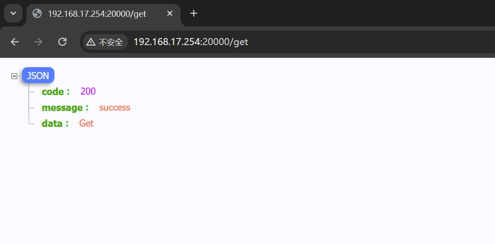
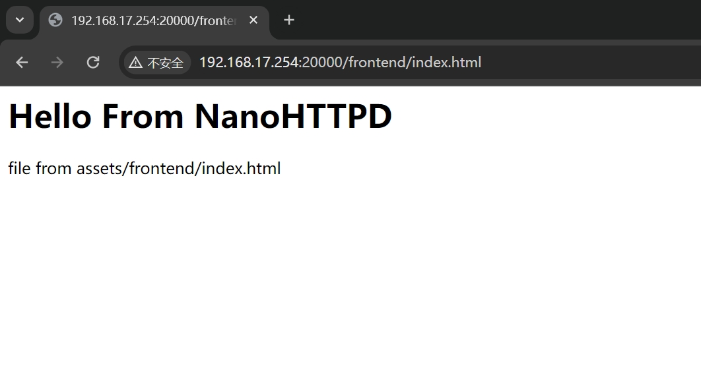
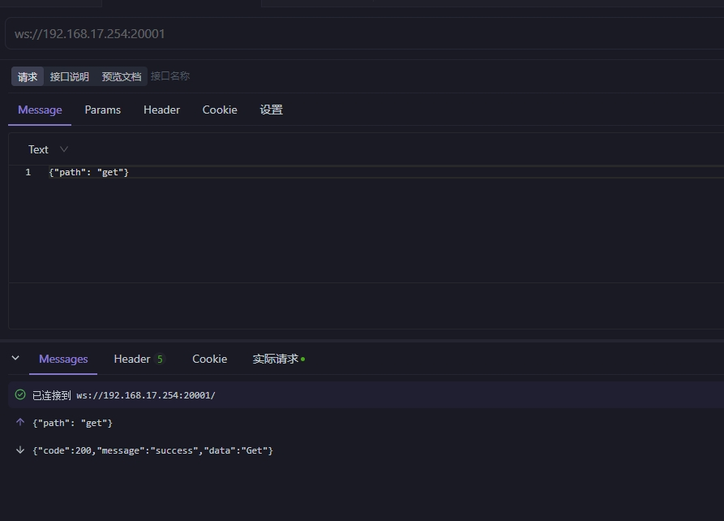
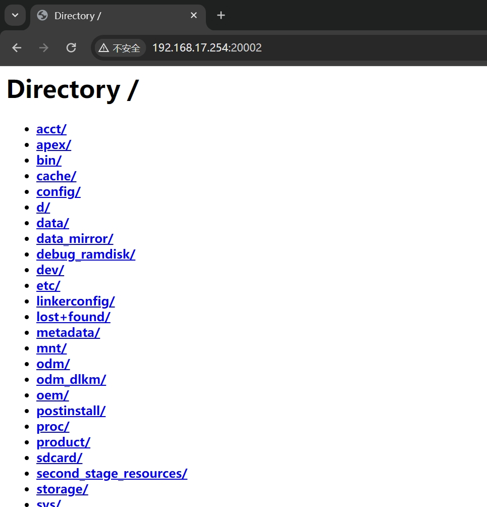

# NanoHTTPD
Android端轻量级的http服务，支持http请求、websocket连接、web文件服务器

## 使用见示例app代码

```kotlin
    fun startHttpServer(port: Int = 20000) {
        if (httpServer?.isAlive == true) {
            Toast.makeText(this, "HttpServer already started at port $port ", Toast.LENGTH_SHORT)
                .show()
            return
        }
        try {
            httpServer = HttpServer(port)
            httpServer?.start()
            Toast.makeText(this, "HttpServer start success at port $port ", Toast.LENGTH_SHORT)
                .show()
        } catch (e: Exception) {
            e.printStackTrace()
            httpServer?.stop()
            httpServer = null
            Toast.makeText(this, "HttpServer start failed at port $port ", Toast.LENGTH_SHORT)
                .show()
        }
    }

    fun startWebsocketServer(port: Int = 20001) {
        if (wsServer?.isAlive == true) {
            Toast.makeText(
                this,
                "WebSocketServer already started at port $port ",
                Toast.LENGTH_SHORT
            ).show()
            return
        }
        try {
            wsServer = WSServer(port)
            wsServer?.start()
            Toast.makeText(this, "WebSocketServer start success at port $port ", Toast.LENGTH_SHORT)
                .show()
        } catch (e: Exception) {
            e.printStackTrace()
            wsServer?.stop()
            wsServer = null
            Toast.makeText(
                this,
                "WebSocketServer start failed at port $port :${e}",
                Toast.LENGTH_SHORT
            ).show()
        }
    }

    fun startWebFileServer(port: Int = 20002) {
        if (webServer?.isAlive == true) {
            Toast.makeText(this, "WebFileServer already started at port $port ", Toast.LENGTH_SHORT)
                .show()
            return
        }
        try {
            // 只有第一个存在并可读的文件夹生效
            val wwwroots = arrayListOf<File>()
            wwwroots.add(File("/")) // 优先尝试根目录，需要root权限
            wwwroots.add(File(App.instance.applicationInfo.dataDir))
            webServer = SimpleWebServer(null, port, wwwroots, true)
            webServer?.start()
            Toast.makeText(this, "WebFileServer start success at port $port ", Toast.LENGTH_SHORT)
                .show()
        } catch (e: Exception) {
            e.printStackTrace()
            webServer?.stop()
            webServer = null
            Toast.makeText(
                this,
                "WebFileServer start failed at port $port :${e}",
                Toast.LENGTH_SHORT
            ).show()
        }
    }
```

## 演示画面
### http请求



### WebSocket


### web文件服务器

